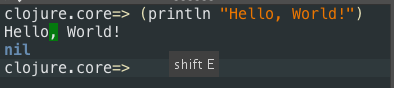
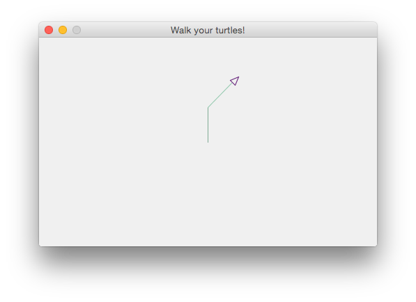
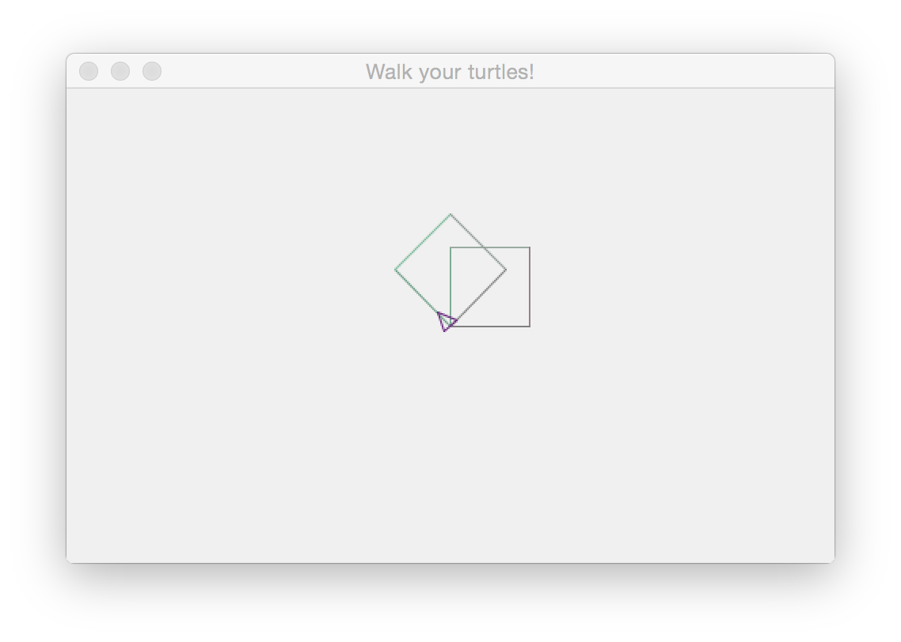
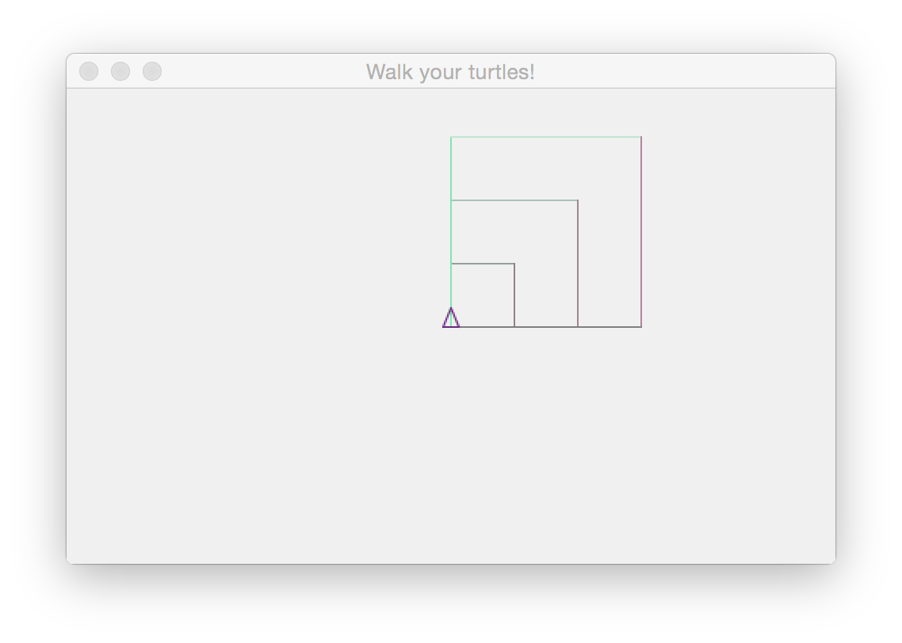

# A Gentle Introduction to Clojure Through Turtles


### Objectives:

1. Have fun with turtles
2. Learn about programming
3. Learn about Clojure


## Section 1. Hello World

Open Nightcode if it's not already open (see the [setup instructions](https://github.com/ClojureBridge/curriculum/blob/gh-pages/outline/setup.md) if you have not already downloaded Nightcode).

```bash
cd ~/Downloads/
java -jar nightcode-1.3.2-standalone.jar
```

In the lower left pane, type 

```clojure
(println "Hello, World!")
```

You should see this:



This is the traditional first program you write in any language. Congratulations, you've just written your first program in Clojure! 

>(Don't worry about the fact that it says "nil" right after "Hello, World!". We'll explain that later.)

## Section 2. Turtles

Something called "turtle graphics" is a very common way to teach programming to beginners, because it's fun and provides immediate visual feedback.

Imagine a little robot turtle on a piece of paper. It has a pen connected to its belly, with the tip of the pen touching the paper. You can tell it to move forward, left or right, and it will leave a mark. We'll be running virtual turtles that behave in the same way.

### Get your turtle up and running

If you haven't already, go to Nightcode and import the "welcometoclojurebridge" project that we downloaded (by using the `git clone` command) during the setup time (again, if you haven't done this yet, refer to the [setup instructions](https://github.com/ClojureBridge/curriculum/blob/gh-pages/outline/setup.md).

Now open the `walk.clj` file, whose full name is `welcometoclojurebridge/src/clojurebridge_turtle/walk.clj`. 

To get to it, click on the plus sign next to each of those folders (`welcometoclojurebridge`, `src`, `clojurebridge_turtle`), then click on `walk.clj` to open it.

Now click the "Run with REPL" button in the lower right hand pane. You'll have to wait about 30 seconds until it prints several lines of output and gives you a REPL prompt (REPL stands for Read-Evaluate-Print-Loop -- we'll explain later) where you can type.

At this point, click the "Reload" button, and it should give you a window with a turtle in it (a little triangle).

### Start drawing with your turtle

Into the lower right pane of Nightcode, type in the following commands (hit "Enter" after typing each line):

```clojure
(forward 50)
(right 45)
(forward 50)
```



Pretty cool, right? 

>But what's all that text that gets output after every command you run, like `{:trinity {:length 50}}` ? Don't worry about that -- we'll explain it later.

### Three ways to undo the turtle's drawings

If you want to undo the most recent thing you did with your turtle, you can use `undo`

```clojure
(forward 50)
(right 45)
(forward 50)
(undo)
```

If you want to clear away all your lines, use `clean`:

```clojure
(forward 50)
(right 45)
(forward 50)
(clean)
```

And if you want to clear away all the lines and send the turtle back to its starting place and starting angle, use `init`:

```clojure
(forward 50)
(right 45)
(forward 50)
(init)
```

### You may be asking yourself at this point, what's up with the parentheses?

Good question.

All commands in Clojure are surrounded by parentheses, and the first thing after the opening parenthesis is always the name of the command, also called a "function". 

If the function needs what is called an "argument" -- like a distance for a turtle to travel -- then the "argument" goes after the name of the function, as in `(forward 50)`, where the function name is `forward` and the argument is `50`.


### Exercises

Ok, let's play with some turtles! Make sure to try different distances for `forward` and different angles for `left` and `right`. See if you can make some interesting shapes and patterns! If you're looking for something to do:

**Exercise 1:** Make a square

**Exercise 2:** Make an equilateral triangle (Hint: the angle to turn each time is 120 degrees).


## Section 3: Arithmetic

You can add, subtract, multiply, and divide numbers: 

```clojure
(+ 1 1) 
; One plus one is two, so this should print:
; 2

(- 12 4) 
; Twelve minus four is eight, so this should print:
; 8

(* 7 2)
; Seven times two is fourteen, so this should print:
; 14

(/ 10 2) 
; Ten divided by two is five, so this should print:
; 5
```

>Note: The semicolons just mean that everything after that on the line gets ignored by the computer because it's not code; it's only meant to be read by humans. 

### But whoa, what's up with putting the arithmetic symbols before the numbers?

This is called "prefix notation", as opposed to the way we're used to writing math, which is "infix notation". 

It's a direct consequence of what we were talking about earlier -- in Clojure, everything we do can be thought of as running a function, and the name of the function always goes first, right after the opening parenthesis. In this case those math symbols (`+`, `*`, etc.) are the function names.

Note that a "function" can be a thing that *does* something -- like `(forward 50)`, which moves a turtle, or it can be a thing that *returns* something, meaning gives us the answer to a question, like "What is one plus one?": `(+ 1 1)`.

Some people love prefix notation and some people hate it. It's a long and complicated argument, but check out this one example where prefix notation comes in handier:

```clojure
(6 + 7 + 3 + 2 + 6 + 9)
```

vs.

```clojure
(+ 6 7 3 2 6 9)
```

You can also combine arithmetic expressions in one line:

```clojure
(+ 8 (/ 20 4)) 
; => 8 + 20/4 = 8 + 5 = 13
```

**Exercise 1:** Play around with arithmetic for a while. Try to do make some compound expressions, like `(+ 8 (/ 20 4))` above.

**Exercise 2:** Use arithmetic in some turtle commands! Like this, which will move the turtle forward 50:

```clojure
(forward (* 5 10))
```

>Note: You can put Clojure expressions -- the things inside parentheses -- inside of each other. The inner ones get calculated first, and then the result gets used in the outer ones. So in this case, `(* 5 10)` equals `50`, so then what gets run is `(forward 50)`.


## Interlude: Three Different Ways of Running Code

There are a few different ways to evaluate (run) Clojure code using the Nightcode program. The REPLs in the lower right and lower left panes, which we have been using so far, are two of them. 

Try typing some basic arithmetic into the lower left pane.

Now type some turtle commands like `(forward 50)` or `(right 90)` into the lower left pane.

The arithmetic works, but the turtle commands don't. 

This is because the turtle commands come from the project that we have open, `welcometoclojurebridge`. They're not a fundamental part of the Clojure language. The lower left pane can only things that are built into Clojure, and the lower right one can run commands from the project you have open. That's the difference between those two panes.

There is also a third way to run some new code, which we'll need if the code we want to run takes up more than one line: type some code into a file itself, like at the bottom of the `walk.clj` file, then select the code, then click "Eval Selection" in the bottom right pane. 

Try that a few times. Type some `forward` and `right` commands into the `walk.clj` file, then select the line you just typed, then click "Eval Selection".


## Section 4: Making functions with `defn`

In one of the exercise above, we had you make a square. The code for this would be something like

```clojure
(forward 50)
(right 90)
(forward 50)
(right 90)
(forward 50)
(right 90)
(forward 50)
(right 90)
```

This is all very nice, but if you wanted to move the turtle somewhere else (or just turn it) and then draw another square, you'd have to write all those lines of code again. You can avoid that by making your own function, using a special word in Clojure called `defn`:


```clojure
(defn draw-square []
  (forward 50)
  (right 90)
  (forward 50)
  (right 90)
  (forward 50)
  (right 90)
  (forward 50)
  (right 90))
```

Then we can do:

```clojure
(draw-square)
(left 45)
(draw-square)
```



>Note: If you want to try typing this stuff in yourself and running it, you'll have to type at least the function definition into the bottom of the `walk.clj` file, and hit "Eval Selection". For the three lines below that, you can do it either that way or in the REPL pane in the lower right.

Notice the square brackets in the definition of the `draw-square` function above. That is where the "arguments" to the function go. The square brackets for the `draw-square` function are empty, which means it takes no arguments. To run a function with no arguments, you just surround the function name with parentheses, as in `(draw-square)`.

**Exercise:** Make a function `draw-triangle` that makes an equilateral triangle, 50 pixels on each side. Remember you'll have to type the function definition into the bottom of `walk.clj` and hit "Eval Selection".

Make a few triangles using your new function. Between drawing each triangle, either move or turn the turtle.

## Section 5: Making Functions with Arguments

Functions with no arguments have their place, but in this case it would be even better if the function took an argument, so it didn't make the same sized square every time:

```clojure
(defn draw-square [size]
  (forward size)
  (right 90)
  (forward size)
  (right 90)
  (forward size)
  (right 90)
  (forward size)
  (right 90))
```

Now we can do: 

```clojure
(draw-square 40)
(draw-square 80)
(draw-square 120)
```



What is going on here? 

Well, every time we run our function `draw-square` (remember that we run functions by writing them inside parentheses), we write a number after it. This is called "passing it an argument". That number gets substituted for the word `size` that we wrote into the argument list for the function, and then the code inside the function gets run. Everywhere it says `size` inside the function, the computer reads `40` the first time through the function, then `80` the second time, then `120` the third time.

**Exercise:** Rewrite the function `draw-triangle` from before, so that you can pass it a `size` argument, and it can make differently sized triangles.

 
## Section 6: More fun with turtles: `dotimes`

A lot of what programmers do is try to eliminate repetition in their code, so they don't have to read and type the same things over and over again. As we can see, the `draw-square` function is a prime candidate for that. 

We can use a function called `dotimes` to take care of that. We can rewrite draw-square as

```clojure
(defn draw-square [size]
  (dotimes [index 4]
    (forward size)
    (right 90)))
```

>Don't worry about the word `index` there. We just put there so that we can use it to indicate which side we're currently drawing, i.e., whether it's the first side, the second side, etc., each time we draw a side. We don't need this right now. The important thing is just the number 4, which means we're going to run the following code 4 times.

**Exercise 1:** Rewrite the `draw-triangle` function from before, so that it is only four lines long -- that is, you only have to run the `forward` and `right` functions once each.

**Bonus exercise:** Write a function, `draw-polygon`, that takes *two* arguments -- a `number-of-sides` and a `size` -- and draws a regular polygon with `number-of-sides` sides, each of which is `size` pixels long.

For this one, you will have to use both arithmetic and turtle graphics!

(Hint: The appropriate angle to turn each time will be 360 divided by the number of sides.) 

## Conclusion

We hope you have enjoyed this introduction. If you have worked through this material, you should be more than ready to tackle the [main curriculum](http://clojurebridge.github.io/curriculum/#/).